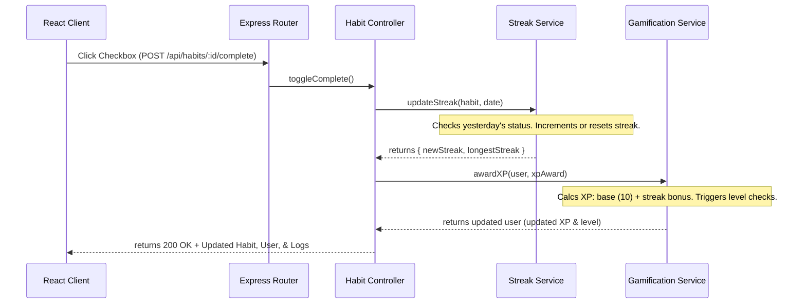

# 🎯 HabitFlow – Enterprise MERN Habit Tracker

HabitFlow is a production-ready, full-stack Habit Tracker SaaS application designed with an Apple-like glassmorphic UI/UX and powered by gamification (XP, levels, badges), daily reflection logs (with mood tracking), an AI productivity coach, community social features, and Stripe billing integrations.

This document provides a comprehensive, file-by-file and function-by-function technical breakdown of the entire codebase, detailing how each component, model, controller, service, middleware, and route functions.

---

## 🚀 Tech Stack

| Layer | Technology | Key Features / Purpose |
| :--- | :--- | :--- |
| **Frontend** | React 19 + Vite 8 | Ultra-fast client, code-splitted routes |
| **Styling** | Tailwind CSS v4 | Custom utility-first classes, transitions, animations |
| **State** | Redux Toolkit + React Query | Syncing global authentication, dashboard caching |
| **Charts** | Recharts | Dynamic SVG visualizations, heatmaps, area charts |
| **Animations**| Framer Motion | Smooth fade-ins, spring physics, layout transition effects |
| **Backend** | Node.js + Express.js | Sturdy, scalable RESTful API with route validation |
| **Database** | MongoDB Atlas (Mongoose) | Document database with relational aggregation queries |
| **Auth** | JWT + Google OAuth + passport.js | Secure cookie storage, stateless token authentication |
| **Security** | Helmet + Rate Limiters | Prevention of XSS, NoSQL injections, and DDoS |
| **Payments** | Stripe | Premium checkout flows and webhooks |
| **Email** | Nodemailer | Transactional emails (verification, reset, daily alerts) |

---

## 📁 Repository Structure

```text
habit-tracker/
├── backend/                  # Express REST API
│   ├── config/               # DB & authentication setups
│   ├── controllers/          # Endpoint controllers (business logic)
│   ├── middleware/           # Route guards, upload handling, validators
│   ├── models/               # Mongoose DB schemas
│   ├── routes/               # API path routing
│   ├── services/             # Background services (emails, gamification, streaks)
│   ├── tests/                # Unit & integration testing suites
│   ├── server.js             # Main server entrypoint
│   └── package.json          # Dependency scripts
└── frontend/                 # React client
    ├── src/
    │   ├── app/              # Redux store configurations
    │   ├── components/       # Reusable components & layouts
    │   ├── features/         # Redux state slices & actions
    │   ├── hooks/            # Custom React hooks (e.g. useNotifications)
    │   ├── pages/            # Page routing endpoints
    │   ├── services/         # Axios API clients
    │   ├── utils/            # Utility formatters
    │   ├── App.jsx           # Routing & global providers
    │   ├── main.jsx          # DOM mounting node
    │   └── index.css         # Custom CSS tokens & dark/light modes
    └── package.json          # Frontend dependencies
```

---

## 🗄️ Backend Architecture & File Map

### 1. Configuration (`backend/config/`)
* **[db.js](file:///c:/Users/loken/Downloads/habit-tracker/backend/config/db.js)**
  * **Functionality**: Establishes a Mongoose connection to MongoDB Atlas.
  * **Methods**: `connectDB()` connects asynchronously to `process.env.MONGODB_URI` with fallback options.
* **[passport.js](file:///c:/Users/loken/Downloads/habit-tracker/backend/config/passport.js)**
  * **Functionality**: Configures `Passport.js` with `passport-google-oauth20` to verify Google accounts.
  * **Flow**: If a Google ID is verified, it retrieves or creates a database user and triggers the authorization callback.

### 2. Middleware (`backend/middleware/`)
* **[auth.middleware.js](file:///c:/Users/loken/Downloads/habit-tracker/backend/middleware/auth.middleware.js)**
  * **Functionality**: Validates JSON Web Tokens (JWT) sent via headers.
  * **Methods**:
    * `protect`: Checks the `Authorization` header for a `Bearer <token>`, verifies it using `jwt.verify`, and assigns `req.user` with the active user record.
    * `admin`: Restricts routes exclusively to users possessing `role === 'admin'`.
* **[upload.middleware.js](file:///c:/Users/loken/Downloads/habit-tracker/backend/middleware/upload.middleware.js)**
  * **Functionality**: Configures `multer` for memory storage to buffer user avatar uploads. Limits files to 2MB and enforces file filters (`jpeg`, `jpg`, `png`).
* **[validate.middleware.js](file:///c:/Users/loken/Downloads/habit-tracker/backend/middleware/validate.middleware.js)**
  * **Functionality**: Validates HTTP request parameters against rules defined by `express-validator`.
  * **Methods**: `validate` checks if input validators reported errors, returning a `400 Bad Request` with array details when validated inputs fail constraints.

### 3. Database Models (`backend/models/`)
* **[User.js](file:///c:/Users/loken/Downloads/habit-tracker/backend/models/User.js)**
  * **Schema**: Houses fields for authentication details, Stripe credentials, gamification state (`xp`, `level`, `badges`), settings, and social relations.
  * **Methods**:
    * `pre('save')`: Hashes plaintext passwords using `bcrypt` (12 rounds) if modified.
    * `comparePassword(candidatePassword)`: Returns a boolean indicating if passwords match.
    * `generateJWT()`: Creates a signed JWT valid for 7 days.
    * `generateRefreshToken()`: Creates a long-lived JWT valid for 30 days.
    * `calculateLevel()`: Recalculates levels dynamically based on user XP thresholds (0, 500, 1500, 3000, 6000, 10000, 20000, 50000).
* **[Habit.js](file:///c:/Users/loken/Downloads/habit-tracker/backend/models/Habit.js)**
  * **Schema**: Schema configuration for habits. Tracks habit settings (title, description, category, frequency, schedule details, custom alert reminders, streaks, archive status).
* **[HabitLog.js](file:///c:/Users/loken/Downloads/habit-tracker/backend/models/HabitLog.js)**
  * **Schema**: Tracks completion history. Documents when habits were marked as done, recording the habit ID, timestamp, completion date, and earned XP rewards.
* **[Goal.js](file:///c:/Users/loken/Downloads/habit-tracker/backend/models/Goal.js)**
  * **Schema**: Captures targets/milestones (title, description, parent user, deadline, status, and sub-milestones with toggles).
* **[Journal.js](file:///c:/Users/loken/Downloads/habit-tracker/backend/models/Journal.js)**
  * **Schema**: Captures user reflection entries (mood rating 1-5, reflection content, tags, and three custom gratitude inputs).
* **[Notification.js](file:///c:/Users/loken/Downloads/habit-tracker/backend/models/Notification.js)**
  * **Schema**: In-app notifications tracking (user reference, notification type, title, message text, and read/unread status).
* **[Payment.js](file:///c:/Users/loken/Downloads/habit-tracker/backend/models/Payment.js)**
  * **Schema**: Records Stripe transaction history (customer IDs, subscription plans, billing status, transaction details).
* **[Challenge.js](file:///c:/Users/loken/Downloads/habit-tracker/backend/models/Challenge.js)**
  * **Schema**: Manages group challenges (target frequencies, time periods, participants, and progress statistics).
* **[Community.js](file:///c:/Users/loken/Downloads/habit-tracker/backend/models/Community.js)**
  * **Schema**: Connects community members and lists group details.

### 4. Controllers (`backend/controllers/`)
* **[auth.controller.js](file:///c:/Users/loken/Downloads/habit-tracker/backend/controllers/auth.controller.js)**
  * **Functions**:
    * `register`: Creates a new user. Auto-verifies in development; in production, generates a verify token and triggers nodemailer.
    * `login`: Checks user credentials, verifies status, and replies with signed JWTs and refresh tokens.
    * `logout`: Revokes active session and overrides refresh cookie.
    * `forgotPassword` & `resetPassword`: Creates secure token URLs, hashes validation fields, and handles reset requests.
    * `verifyEmail`: Marks accounts as verified and awards the "Verified" badge.
* **[habit.controller.js](file:///c:/Users/loken/Downloads/habit-tracker/backend/controllers/habit.controller.js)**
  * **Functions**:
    * `createHabit`: Saves a habit. Increments `totalHabitsCreated` count and unlocks creation badges (`first_habit`, `habit_5`, `habit_10`).
    * `getHabits`: Resolves habits filtered by query status (active/archived).
    * `toggleComplete`: Toggles a habit's status for a given day. Marks the date, awards XP via `gamification.service.js`, updates streaks via `streak.service.js`, and records logs.
* **[analytics.controller.js](file:///c:/Users/loken/Downloads/habit-tracker/backend/controllers/analytics.controller.js)**
  * **Functions**:
    * `getDashboardStats`: Aggregates stats for the active user, including completion rate, streak numbers, and XP levels.
    * `getWeeklyAnalytics`: Summarizes completions across a rolling 7-day window.
    * `getYearlyHeatmap`: Generates the habit-log completion map used by frontend grid components.
* **[goal.controller.js](file:///c:/Users/loken/Downloads/habit-tracker/backend/controllers/goal.controller.js)**
  * **Functions**:
    * `createGoal`, `getGoals`, `updateGoal`, `deleteGoal`: Full CRUD actions for setting goals.
    * `addMilestone` & `toggleMilestone`: Adds or toggles checkboxes inside a goal's sub-list.
* **[journal.controller.js](file:///c:/Users/loken/Downloads/habit-tracker/backend/controllers/journal.controller.js)**
  * **Functions**:
    * `createJournal`: Registers a daily reflection, checks for duplicate dates, and awards XP.
    * `getMoodHistory`: Returns mood trends over time.
* **[notification.controller.js](file:///c:/Users/loken/Downloads/habit-tracker/backend/controllers/notification.controller.js)**
  * **Functions**:
    * `getNotifications`: Fetches notifications, sorting unread alerts first.
    * `markAsRead`: Marks individual notifications as read.
    * `markAllAsRead`: Sets all notification statuses for a user to read.
* **[user.controller.js](file:///c:/Users/loken/Downloads/habit-tracker/backend/controllers/user.controller.js)**
  * **Functions**:
    * `getProfile`: Resolves the current user's profile info.
    * `updateProfile`: Updates settings, profile fields, avatar uploads, and theme preferences.
* **[social.controller.js](file:///c:/Users/loken/Downloads/habit-tracker/backend/controllers/social.controller.js)**
  * **Functions**:
    * `getLeaderboard`: Ranks users globally based on accumulated XP.
    * `sendFriendRequest`, `acceptRequest`, `removeFriend`: Manages user relationships.
* **[admin.controller.js](file:///c:/Users/loken/Downloads/habit-tracker/backend/controllers/admin.controller.js)**
  * **Functions**:
    * `getAdminStats`: Generates platform-wide summaries (e.g. total signups, premium conversions).
* **[ai.controller.js](file:///c:/Users/loken/Downloads/habit-tracker/backend/controllers/ai.controller.js)**
  * **Functions**:
    * `getHabitSuggestions`, `analyzeBurnout`, `getCoachingMessage`: Calls AI models to analyze user consistency, identify fatigue patterns, and suggest custom habit schedules.
* **[payment.controller.js](file:///c:/Users/loken/Downloads/habit-tracker/backend/controllers/payment.controller.js)**
  * **Functions**:
    * `createCheckoutSession`: Initiates Stripe Checkout sessions for premium plan upgrades.
    * `stripeWebhook`: Listens for Stripe status updates to unlock premium accounts.

### 5. Services (`backend/services/`)
* **[gamification.service.js](file:///c:/Users/loken/Downloads/habit-tracker/backend/services/gamification.service.js)**
  * **Functionality**: Controls gamification rules (XP awards, level changes, achievement badges).
  * **Methods**:
    * `calculateXP(streak)`: Base XP (10) + streak bonus (streak * 0.5).
    * `awardXP(user, xpAmount)`: Increments XP, triggers `calculateLevel()`, and creates level-up notifications.
    * `unlockAchievement(user, achievementType)`: Checks if an achievement exists, updates user's unlocked list, issues the badge, and triggers in-app notifications.
* **[streak.service.js](file:///c:/Users/loken/Downloads/habit-tracker/backend/services/streak.service.js)**
  * **Functionality**: Maintains streak counts.
  * **Methods**:
    * `updateStreak(habit, date)`: Determines if the previous day was completed. If yes, increments streak; if not, resets it to 1.
    * `recalculateStreak(habit)`: Scans database logs back 200 days to rebuild streak calculations when completion logs are modified.
* **[email.service.js](file:///c:/Users/loken/Downloads/habit-tracker/backend/services/email.service.js)**
  * **Functionality**: Configures `nodemailer` with credentials.
  * **Methods**: `sendVerificationEmail`, `sendPasswordResetEmail`, and `sendReminderEmail` send HTML-formatted templates with login resources.

---

## 💻 Frontend Architecture & File Map

### 1. Global Setup & Routes
* **[main.jsx](file:///c:/Users/loken/Downloads/habit-tracker/frontend/src/main.jsx)**
  * Mounts the React application inside the DOM root, wrapped in the Redux store provider.
* **[App.jsx](file:///c:/Users/loken/Downloads/habit-tracker/frontend/src/App.jsx)**
  * **Routing**: Uses `react-router-dom` to manage application routes.
  * **Guards**:
    * `ProtectedRoute`: Redirects to `/login` if `isAuthenticated` is false.
    * `PublicRoute`: Redirects to `/dashboard` if the user is already authenticated.
* **[index.css](file:///c:/Users/loken/Downloads/habit-tracker/frontend/src/index.css)**
  * Contains global styles, resets, animations, utility definitions, scrollbar modifications, and dark/light mode CSS theme variables.

### 2. Redux State Slices (`frontend/src/features/`)
* **[authSlice.js](file:///c:/Users/loken/Downloads/habit-tracker/frontend/src/features/auth/authSlice.js)**
  * **State**: Tracks `user` profile info, JWT `token`, `isAuthenticated` flag, and loading states.
  * **Actions**: Async thunks handle registration, login, profile updates, and password changes.
* **[habitSlice.js](file:///c:/Users/loken/Downloads/habit-tracker/frontend/src/features/habits/habitSlice.js)**
  * **State**: Maintains lists of active habits and history logs.
  * **Actions**: Manages habit creation, updates, completion toggles, and deletion.
* **[analyticsSlice.js](file:///c:/Users/loken/Downloads/habit-tracker/frontend/src/features/analytics/analyticsSlice.js)**
  * **State**: Caches weekly averages, monthly metrics, and heatmap data.
* **[goalSlice.js](file:///c:/Users/loken/Downloads/habit-tracker/frontend/src/features/goals/goalSlice.js)**
  * **State**: Manages user goals and sub-milestones.
* **[journalSlice.js](file:///c:/Users/loken/Downloads/habit-tracker/frontend/src/features/journal/journalSlice.js)**
  * **State**: Manages diary history and mood statistics.
* **[notificationSlice.js](file:///c:/Users/loken/Downloads/habit-tracker/frontend/src/features/notifications/notificationSlice.js)**
  * **State**: Stores alerts list and tracks unread count sync.
* **[socialSlice.js](file:///c:/Users/loken/Downloads/habit-tracker/frontend/src/features/social/socialSlice.js)**
  * **State**: Tracks friends, requests, and leaderboard rankings.
* **[uiSlice.js](file:///c:/Users/loken/Downloads/habit-tracker/frontend/src/features/ui/uiSlice.js)**
  * **State**: Stores UI preferences, sidebar toggles, and view configurations.

### 3. Layouts & Components (`frontend/src/components/`)
* **[AppLayout.jsx](file:///c:/Users/loken/Downloads/habit-tracker/frontend/src/components/layout/AppLayout.jsx)**
  * **Layout**: Renders the shell container with the sidebar menu and main header.
  * **Features**: Displays user level XP and real-time notification alerts. Synced to dynamically update when items are read.
* **[AuthLayout.jsx](file:///c:/Users/loken/Downloads/habit-tracker/frontend/src/components/layout/AuthLayout.jsx)**
  * **Layout**: Centered card layout with animated orb backgrounds, optimized for authentication screens.

### 4. Page Views (`frontend/src/pages/`)
* **[LandingPage.jsx](file:///c:/Users/loken/Downloads/habit-tracker/frontend/src/pages/LandingPage.jsx)**
  * **Design**: Fully responsive landing page with glassmorphism layouts, feature grids, pricing tables, testimonials, and FAQs.
* **[DashboardPage.jsx](file:///c:/Users/loken/Downloads/habit-tracker/frontend/src/pages/DashboardPage.jsx)**
  * **Design**: Main user panel. Displays user level, productivity score, streak metrics, today's habit check-list, and the AI coach feed.
* **[HabitsPage.jsx](file:///c:/Users/loken/Downloads/habit-tracker/frontend/src/pages/HabitsPage.jsx)**
  * **Design**: Habit management view. Includes CRUD creation drawers, category filtering tabs, and custom frequency toggles.
* **[JournalPage.jsx](file:///c:/Users/loken/Downloads/habit-tracker/frontend/src/pages/JournalPage.jsx)**
  * **Design**: Split-panel interface (entries list on the left, editor on the right). Features mood trackers, gratitude logs, and mood trend charts.
* **[ProfilePage.jsx](file:///c:/Users/loken/Downloads/habit-tracker/frontend/src/pages/ProfilePage.jsx)**
  * **Design**: User settings view. Handles profile updates, dark/light theme toggling, and notification preferences. Badge layouts are wrapped using flex rows to prevent overlapping on mobile.

---

## ⚡ Key System Workflows

### 1. Habit Completion & Streak Updates


### 2. Gamification & Achievements
XP is awarded for completing habits and logging reflections. When XP meets defined thresholds, users level up and earn badges:
1. **Level Ups**: `user.calculateLevel()` evaluates user XP. When a level increases, an in-app notification is created.
2. **Badges**: Triggered by milestone achievements (e.g. `first_habit`, `streak_30`). Unlocking badges awards bonus XP and creates a notification record.

---

## 🔐 Security Architecture

1. **Authentication**: JWT tokens stored locally; refresh tokens stored in secure, HttpOnly, SameSite cookies to protect against CSRF.
2. **Rate Limiting**: Enforces rate limits on API requests (100 req / 15 minutes) and stricter limits on authentication endpoints (10 attempts / 15 minutes).
3. **Data Protection**:
   * Enforces TLS on connection endpoints.
   * `express-mongo-sanitize` prevents NoSQL injection attacks.
   * `helmet` protects HTTP headers and mitigates XSS risks.

---

## 🛠️ Local Development & Setup

### Environment Variables
Create `.env` configurations in the respective folders:

**Backend `.env`**:
```ini
PORT=5000
NODE_ENV=development
MONGODB_URI=your_mongodb_connection_uri
JWT_SECRET=your_jwt_signature_secret
FRONTEND_URL=http://localhost:5173
EMAIL_USER=your_smtp_username
EMAIL_PASS=your_smtp_app_password
GOOGLE_CLIENT_ID=your_google_client_id
GOOGLE_CLIENT_SECRET=your_google_client_secret
STRIPE_SECRET_KEY=your_stripe_secret_key
```

**Frontend `.env`**:
```ini
VITE_API_URL=http://localhost:5000/api
```

### Running the App
1. **Backend setup**:
   ```bash
   cd backend
   npm install
   npm run dev
   ```
2. **Frontend setup**:
   ```bash
   cd frontend
   npm install
   npm run dev
   ```
